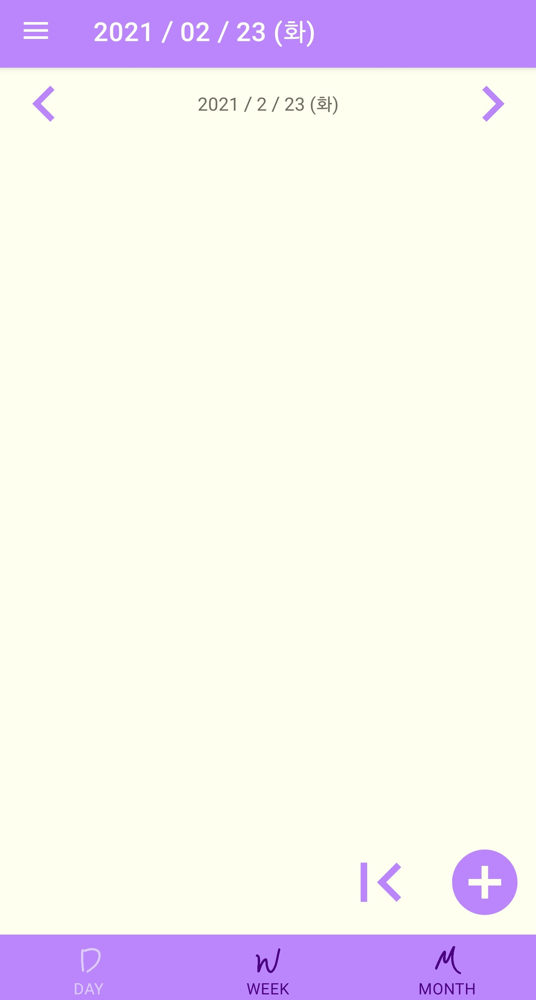

# eazy-list

- Android To-Do List Application

------------------------------------------------------------

## 사용방법 (Usage)

### 1. 날짜 이동 및 일정 추가 (Change Date and Add Schedule)
 

 
- [왼쪽/오른쪽] 버튼을 눌러 [이전/다음] [일/주/월]로 넘어갈 수 있습니다. "+" 버튼을 눌러 새로운 일정을 추가하세요(데일리/몬슬리 리스트의 경우).
- You can go to the [last/next] [day/week/month] by pressing [left/right] button. Add new schedule by pressing "+" button(in Daily and Monthly Page).
 
 

### 2. 위클리 리스트에서 일정 추가 (Add Schedule in Weekly Page)
 

 
- 새로운 일정을 추가하고 싶다면 해당 요일의 몸통 부분이 아닌 상단의 글자/요일 부분을 눌러야 합니다.
- If you want to add a new schedule, tap the text at the top of the day.
 
 

### 3. 몬슬리 리스트 (In Monthly Page)
 

 
- 달력의 빨간 숫자는 아직 끝내지 못한 일정의 숫자를 나타냅니다. 달력의 각 날짜를 누를 경우 해당 날짜의 Daily List 화면으로 전환됩니다.
- The red number on each day represents the number of events that have not yet been completed. Tap a date to go to the daily list tab for that date.
 
- 메모장을 수정하고 싶을 때는 메모장의 몸통 부분이 아닌 메모장 상단의 글자 부분을 눌러야 합니다.
- If you want to edit the note, you have to press the text part at the top, not the body part of the notepad.
 
 

### 4. 일정 박스 (Event Box)
 

 
- 데일리 리스트와 위클리 리스트 화면에서, 각 일정 박스를 짧게 클릭함으로써 일정 완료/미완료 상태를 전환할 수 있습니다.
- In the daily list and weekly list, you can switch between completed/incomplete status by briefly clicking on each item.
 

 
- 일정 박스를 길게 클릭하면 일정의 내용을 클립보드에 복사하거나, 일정을 삭제/수정할 수 있습니다.
- If you long-click each item, you can copy the contents of the schedule to the clipboard or delete/edit the schedule.
 
 

### 5. 네비게이션 서랍 (Navigation Drawer)
 

 
- 왼쪽 상단의 햄버거 버튼을 누르면 네비게이션 서랍을 열 수 있습니다. 각 메뉴를 눌러 모든 일정을 삭제하거나, 앱의 테마(보라/파랑/검정)를 변경하거나, 도움말 창을 열거나, 혹은 OSS의 라이선스 고지 내용을 확인할 수 있습니다.
-  You can open the navigation drawer by pressing the hamburger button in the upper left corner. Each option allows you to reset all schedules, change themes, get help, or view the license notice for open source software.
